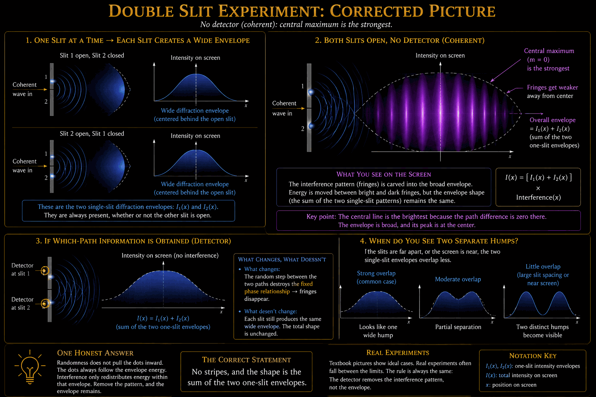

# The Detector, Understood: Single-Photon Phenomena in the Rope Framework, in Plain Language

**Mark Palmer** · with computational collaboration by Claude (Anthropic)

Charlotte, NC · palmer100@gmail.com

August 2026 · Rope Framework corpus, v3.8.0+

*Companion to the measurement-sector campaigns, FND-STRAND-009 through 029
(releases v3.7.0 onward), including the third grant. Written for a reader
outside the project. Canonical paper: `papers/the_detector_understood.pdf`;
this markdown is its living source. Every claim referenced here has a registered entry in
`claims.yaml`, an executable benchmark, and pre-committed pass criteria in
`analysis/`.*

---

## The standard evidence for quantized light: a seven-item scoreboard

Physics textbooks support quantized light with a standard list of
experiments. Since the framework adopted its third assumption (the
quantum arrives whole, explained below), each item on that list now has
a definite, registered status. For each, we give the standard
quantum-optical account as a physicist would state it, then the rope
account. The point of the contrast is not that the standard predictions
are wrong -- they are superbly confirmed -- but that the standard
*story* underneath them leans on objects no one can point to (a
wavefunction that is real enough to interfere yet collapses when looked
at, an indivisibility with no carrier, a choice made by nothing), while
the rope account replaces each of those with a mechanical event you
could in principle watch.

### 0. The double slit, one photon at a time: DERIVED

**What quantum optics says.** Fire single photons at a two-slit barrier,
one at a time, hours apart, and each lands as a single dot on the
screen. Yet as the dots accumulate they build up an interference
pattern, bright and dark bands, exactly as if a wave had passed through
both slits at once. Since only one photon is ever in the apparatus, the
standard telling is that each photon interferes *with itself*: its
wavefunction passes through both slits, the two amplitudes superpose,
and |psi|^2 gives the landing-probability pattern. Cover one slit, or
place a which-path detector, and the interference vanishes -- the wave
behavior and the which-slit fact are complementary and cannot both be
had. The dot is where the wavefunction "collapses" to a position on
detection. What travels as a spread-out wave but arrives as a point, why
detection localizes it, and how a single indivisible photon "goes
through both slits," are the familiar puzzles, stated as facts of nature
rather than explained. Feynman called this the one mystery of quantum
mechanics, the phenomenon that contains everything strange about the
theory.

**What rope theory says.** Nothing pointlike ever travels, so there is
no particle that must be in two places and no self-interference to
explain. Each emission is a torsional wave on the strand network, and a
wave threads both slits every single time -- there is nothing unusual in
that, it is what waves do -- laying down the full striped standing
pattern of delivered energy across the screen. The classical two-slit
intensity law I proportional to 1 + cos(2 pi Delta / lambda) is already
a Derived result of the framework, from ordinary linear superposition
(EM-004). The dot is not the photon arriving; it is the *detector
firing*, a threshold nucleation that is pointlike for the same reason a
single ping of rain on a tin roof is pointlike, because that is what
tripping a threshold looks like. Where the dot lands is drawn from the
wave's own energy map: the chance at any spot is proportional to the
energy the wave delivered there (the registered Born-rate structure), so
each single dot is a sample from the same standing striped pattern. Fire
ten thousand photons over ten hours and the dots trace the stripes,
because every dot was drawn from the same map -- no photon needs to
remember the ones before it, and none ever "chooses a slit," because
none ever travels as a particle. Cover a slit and the map loses its
stripes; the dots follow. The wave delivers the odds; the bath delivers
the dot. The one honest boundary, stated rather than glossed: this is
the plain single-screen double slit. Splitting one photon's energy
between two *separated* detectors and having exactly one fire is the
funneling step, which needs the whole-quantum rule (item 1) and is
registered, at absorption, as the framework's surveyed edge.

*Figure: the corrected double-slit picture. Panel 1: each slit alone
produces a wide single-slit envelope. Panel 2: both slits open and
coherent -- the fringes are carved into the sum of the two envelopes,
with the central maximum strongest. Panel 3: a which-path detector
destroys the fixed phase relationship, so the fringes vanish and the
screen shows the plain sum of the two envelopes; the envelope shape
itself is unchanged. Panel 4: whether that sum looks like one wide hump
or two distinct humps depends only on slit spacing and screen distance
(envelope overlap), not on any change in the physics.*

### 1. Beam-splitter correlations (Grangier-Roger): DERIVED

**What quantum optics says.** A single photon meets a 50/50 beam
splitter. In the quantized-field description the photon is prepared in a
one-particle Fock state, and at the splitter it enters a coherent
superposition of two orthogonal spatial modes -- transmitted and
reflected -- written a|t> + b|r> with |a|^2 = |b|^2 = 1/2. The field
genuinely occupies both output arms; that is what lets it interfere if
the arms are later recombined. Yet when two detectors watch the arms,
exactly one fires, and the anticorrelation parameter drops below the
classical bound (Grangier, Roger and Aspect measured it well under one),
which no divisible classical field can do. The standard account bridges
"the field is in both arms" and "only one detector clicks" by
measurement collapse: the act of detection projects the superposition
onto one mode, and does so globally, so that the instant one detector
fires the other's probability drops to zero even though nothing
mechanical connected them. What "collapse" *is*, why it happens on
detection and not before, and how the two arms coordinate their
outcomes, are left as the measurement problem -- acknowledged, not
solved.

**What rope theory says.** Two things are kept strictly separate that
the standard story fuses: the wave and the quantum. The torsional wave
on the strand network is an ordinary classical excitation, and it does
split at the mirror -- part threads each arm, exactly as a wave should,
with no mystery and no superposition-of-a-particle. What cannot split is
the *quantum*: the conserved, integer-valued packet of channel energy
the wave carries. Indivisibility here is not an axiom hung on a
pointlike object; it is topological, the same integer that makes charge
and linking number whole. At absorption the quantum is delivered to
exactly one nucleation channel -- one detector -- and which channel wins
is set by the framework's already-registered probability rule: the
chance of arm i is its share of the delivered energy, P(i) = E_i / sum_j
E_j. For a balanced splitter that is one-half each, so exactly one side
clicks, 50/50, and the anticoincidence is exact (g2(0) = 0 for a single
quantum) because there is only one quantum to place. No collapse is
invoked and none is needed: there was never a particle spread across
both arms waiting to be projected, only a wave (really in both arms) and
a quantum (really delivered to one). The consistency check the standard
collapse postulate usually omits is stated here on the claim's face:
feed the same machinery ordinary coherent light and it thins to
independent Poisson clicks with g2(0) = 1 -- the framework *cannot*
manufacture a quantum signature for classical light, which is exactly
the line a good granularity postulate must not cross (FND-STRAND-025,
Derived).

### 2. Antibunching: DERIVED, with a bonus theorem

**What quantum optics says.** A true single-photon source never
produces two simultaneous clicks: split its output and the two arms
never fire together. Formally the second-order coherence at zero delay
obeys g2(0) = <n(n-1)>/<n>^2, and for a one-photon number state this is
identically zero, whereas every classical field satisfies g2(0) >= 1 (a
Cauchy-Schwarz bound on a nonnegative, divisible intensity). Sub-unity
g2(0) is therefore treated as a signature of nonclassical light with no
wave explanation at all. In practice the measured value sits above zero
-- historically around 0.18 -- and the textbook reading is "imperfect
antibunching," a blemish attributed vaguely to the apparatus.

**What rope theory says.** Because delivery is by whole quanta, a
beam-splitter g2 measurement is simply a multinomial sampler of the
source's photon number, and the framework proves the result exactly: the
measured g2 equals the source's normalized second factorial moment,
<n(n-1)>/<n>^2, *independent of the splitter ratio and of both arm
efficiencies*. Every instrumental constant cancels in the ratio. That
yields a theorem the standard pedagogy rarely states plainly -- loss
cannot create or destroy antibunching -- which is precisely why the
historic experiments were entitled to trust their anticoincidence
figure through lossy, unbalanced optics. The classical bound g2 >= 1 is
not violated but *reinterpreted*: it was always a theorem about
divisible intensities, and once the sampled object is integer quanta its
premise is simply absent. And the famous 0.18 stops being a blemish and
becomes a measurement: a real source is a mixture of one- and two-quantum
emissions, g2 = 2p2/(p1 + 2p2)^2, so 0.18 pins the two-quantum
contamination (about p2 = 0.11 at p1 = 0.89). It is a number about the
source's purity, not the detector's imperfection, and it is confrontable
against any published heralded-source characterization (FND-STRAND-026,
Derived).

### 3. Photon-count statistics: DERIVED, both regimes

**What quantum optics says.** Count clicks in a fixed window. Laser
light gives a Poisson distribution; a single-mode thermal source (a
filtered lamp) gives the wider Bose-Einstein distribution, the counting
face of Hanbury Brown-Twiss bunching. In the quantized theory these
follow from the photon-number statistics of the field's quantum state --
coherent states for the laser, thermal states for the lamp. But there is
a historical awkwardness the quantized account has to explain away:
these same distributions drop out of a fully semiclassical treatment, in
which the field is a classical wave and only the detector is quantized
(Mandel's counting formula). For all ordinary light the two pictures
agree, which is why a century of optics needed no photons and why
photon-counting alone never forced the quantum issue -- a coincidence
the standard framework notes but does not derive.

**What rope theory says.** Both regimes fall out of the framework's own
detector, already built twenty sessions earlier, with the coincidence
explained as a theorem rather than left as a curiosity. In steady weak
illumination the click rate tracks the delivered intensity, lambda(t) =
c I(t) (the registered Born-rate structure), and each click is a
memoryless threshold nucleation, so the counts are Poisson at fixed
drive. Let the drive fluctuate slowly and the click record becomes a Cox
process -- a Poisson process with a randomly modulated rate -- whose
count distribution is exactly Mandel's semiclassical formula, P(m) =
average of (eta W)^m e^{-eta W}/m! over the integrated intensity W.
Constant intensity gives Poisson (laser); a fluctuating thermal
intensity gives Bose-Einstein (lamp). The classical boundary is placed
precisely: the Mandel Q parameter is nonnegative for every classical
drive, so sub-Poissonian counting is the counting twin of g2 < 1 and
requires whole-quantum delivery (a Fock source thins to a Binomial, Q =
-eta exactly). And the historical coincidence becomes the framework's
correspondence theorem: on every classical source the two describe, the
granular and semiclassical accounts are provably the same theory viewed
at two grains. That is *why* classical optics thrived without photons --
not an accident, a theorem the framework proves about itself
(FND-STRAND-027, Derived).

### 4. Delayed choice: DERIVED AS A NON-PARADOX

**What quantum optics says.** Wheeler's setup: a photon enters an
interferometer, and the experimenter decides whether to insert the
second, recombining beam splitter *after* the photon is already past the
first one. Insert it and an interference pattern appears (wave behavior);
leave it out and the detectors reveal which arm was taken (particle
behavior). Because the choice is made while the photon is "in flight,"
the standard telling has the photon retroactively deciding, at BS1,
whether it was a wave or a particle -- the outcome of a past event fixed
by a later free choice. This is usually wrapped in Bohr's complementarity
("no phenomenon is a phenomenon until it is an observed phenomenon") and
sometimes in frankly retrocausal language, and it is offered as evidence
that a quantum system has no definite properties until measured. The
duality between the two behaviors is sharpened into the
Englert-Greenberger-Yasin relation V^2 + D^2 <= 1, presented as a deep
complementarity bound trading fringe visibility V against which-path
distinguishability D.

**What rope theory says.** The paradox needs a variable -- which arm the
particle took at the first splitter -- for the late choice to reach back
and set. The framework has no such variable at any time, so there is
nothing to retro-affect and the puzzle simply has no referent.
Propagation is untouched by the whole-quantum rule: the torsional wave
threads *both* arms in every configuration, nothing is decided at the
first splitter because no trajectory exists to decide, and the only
discrete event is absorption. There the quantum is delivered whole to one
channel, with Born weights set by the apparatus *as it stands at the
moment of absorption*. From this, choice-timing invariance is a one-line
theorem: the statistics depend only on the channel-energy configuration
at absorption, so *when* the choice was made cannot matter provided it
precedes absorption. The late insertion of a beam splitter simply
disposes of a wave still in flight -- ordinary forward causation, zero
retrocausality -- and the experimental record (no dependence on choice
timing) becomes the framework's boring null prediction instead of a
quantum shock. The "which-path statistics" of the open configuration are
50/50 clicks without a which-path fact, because delivery-to-one-detector
is not travel-down-one-arm. And the celebrated duality relation is
demoted from deep bound to arithmetic: with a partial recombiner of
reflectivity R the output energy is 1/2 + sqrt(R(1-R)) cos(phi), giving
V = 2 sqrt(R(1-R)) and D = |1-2R|, so V^2 + D^2 = 1 identically for every
R -- one fixed energy budget partitioned between an interfering and a
non-interfering part (FND-STRAND-028, Derived).

### 5. Hong-Ou-Mandel interference: PINNED, not yet explained

**What quantum optics says.** Send two identical photons into a 50/50
beam splitter, one from each side. They always leave together, both out
of the same port, never one each -- the coincidence rate drops to zero
(the HOM dip). The quantized explanation is genuine two-photon
interference: the amplitude for both-transmitted and the amplitude for
both-reflected are equal and opposite (the bosonic minus sign from two
reflections), so the "one each" outcome cancels. The depth of the dip
measures how indistinguishable the two photons are, and no
single-photon or classical-wave picture reproduces it at full strength
-- a classical treatment caps at 50% visibility, while the quantum
result reaches 100%. HOM is the deepest two-photon effect below the Bell
tests, and it is entirely a statement about the joint amplitude of two
identical quanta, an object with no single-particle counterpart.

**What rope theory says.** Here the framework does something most
theories avoid: it derives the exact size of what it *cannot* yet
explain, and refuses to paper over the gap. Two internal routes are
each pinned. The classical-wave route -- two packets with random relative
phase interfering inside the framework's own detector theory -- gives a
coincidence visibility of at most one-half, attained only when the
amplitudes match exactly, and degraded by any imbalance: the textbook
50% cap, now a derived closed form. The granular route -- two quanta each
delivered independently by the whole-quantum rule -- gives *no* dip at
all (visibility zero), because two independent deliveries land in the
same joint pattern as fully distinguishable photons. So the very
per-quantum independence that made the whole-quantum rule so clean
everywhere else (it recovered the classical limit, forbade fake
antibunching, made delayed choice boring) is exactly what fails here.
The pin table is therefore explicit: granular 0, wave <= 1/2, quantum
mechanics 1, experiment routinely above 0.9. The missing ingredient is
located with unusual precision -- not in how the quanta propagate, not in
how they are detected, but in a *correlation in how two indistinguishable
quanta are delivered*. The shape of the fix is even specified (a
joint-delivery rule, the two-quantum echo of the whole-quantum grant),
along with the conditions that would kill it, and it is deliberately not
adopted: a new postulate is an authorial decision with a real austerity
cost, and this result *pins* the boundary rather than *purchasing* the
crossing (FND-STRAND-029, Modeled).

### 6. Heralded single photons, and the quantum eraser: HONESTLY DEFERRED

**What quantum optics says.** Two related setups. Heralding: a nonlinear
crystal splits one pump photon into a correlated pair (parametric
down-conversion), and detecting one member announces -- "heralds" -- the
presence of its twin, giving an on-demand single photon. The quantum
eraser: which-path information about one photon is stored in an entangled
partner, and by choosing how to measure the partner one can "erase" that
information and restore an interference pattern that which-path knowledge
had destroyed -- even, in the delayed-choice version, after the first
photon has already been detected, which is again given a retrocausal
gloss. Both rest on entanglement: genuinely nonlocal correlations
between separated systems that violate the Bell/CHSH inequalities and so
cannot be reproduced by any locally-caused, definite-outcome mechanism.

**What rope theory says.** The framework declines both, and says exactly
why. Heralding is a statement about the *source* -- how a correlated pair
is born in the crystal -- and the framework has built a mechanical model
of the detector, not of the source; that sector is registered as open,
not quietly assumed. The entangled eraser sits behind the corpus's
oldest and most firmly proven boundary: a local counting model cannot
produce Bell-type (CHSH) correlations, full stop. That is not a gap
awaiting a clever session; it is a theorem (the whole-quantum rule is
explicitly local and per-outcome, and grants no entanglement), and the
registry records it as a wall rather than promising a crossing. Deferring
these honestly -- naming the source model as unbuilt and the Bell
boundary as proven -- is itself the point: the framework marks the edge
of its jurisdiction instead of blurring it.

The pattern across the scoreboard: the double slit and four more items
converted from quantum mystique into detector bookkeeping, one bounded
with its missing piece located to the millimeter, one deferred with the
reason named. In every
case the standard predictions stand; what the rope account removes is the
unpointable machinery beneath them -- the collapsing wavefunction, the
carrierless indivisibility, the choice made by nothing -- and replaces it
with a wave that is really in both arms and a quantum that is really
delivered to one. Every verdict traces to a registered claim with an
executable check.

## Three questions this framework can now answer

Before the detail, here are the three results in their simplest form.
Everything below unpacks them; every sentence traces to a registered,
benchmarked claim.

**1. How does a single-photon detector actually work?**
A click is a real mechanical event: a tiny knot forming on a strand when
enough energy gathers at one spot. The detector is a threshold device,
like a mousetrap. The surrounding medium (the weave) is a warm bath that
constantly jiggles the strand, and the rate of clicks follows the classic
escape-over-a-barrier law. The remarkable part: the "attempt rate" in
that law is not a fitted number. It is the bath's own minimum vibration
frequency, the strand mass scale. The medium itself is the detector's
metronome, and this held up under two independent statistical methods
with opposite failure modes.

**2. Why does a small detector seem to have memory, when nothing in it
remembers anything?**
Freshly reset small detectors click fast at first and then settle down,
which looks like aging or memory. We hunted for the memory with
purpose-built instruments and found nothing changing: temperature flat,
forces flat, no starting condition predicting anything. The answer came
from changing one line: start the detector in true equilibrium with its
bath instead of switched on cold, and the effect vanishes completely.
The "memory" was a switch-on transient, the brief extra jostling any
system feels while it and its bath get acquainted. Nothing inside ever
remembers; the appearance of memory is the echo of the power-up. And
detector size hides the effect by pure arithmetic: a large detector is
many independent click sites racing each other, the first click always
comes early, and early clicks only ever sample the settled behavior. We
proved the exact law: the large detector's statistics are the small
one's raised to the size ratio, with zero adjustable constants.

**3. How can single photons, fired one at a time over hours, build up an
interference pattern, as if each one interferes with itself?**
(This is the double slit of scoreboard item 0, restated as one of the
three questions; the mechanism is worth seeing twice.)
Because nothing pointlike ever travels. Each emission is a wave that
goes through both slits every single time and lays the full striped
energy pattern on the screen. The dot is not the photon arriving; the
dot is the detector firing, a threshold event that is pointlike because
that is what tripping a threshold is, like one ping of rain on a tin
roof. The odds of the dot landing at any spot are proportional to the
wave energy delivered there, so each photon's single dot is a sample
drawn from the same standing striped pattern. Fire ten thousand photons
over ten hours and the dots trace the stripes, because every dot was
drawn from the same map. Nothing needs to remember anything between
shots, and no photon ever "chooses a slit," because no photon ever
travels as a particle. The wave delivers the odds; the bath delivers
the dot.

One honest sentence to complete the picture: this account is
established for the plain double-slit, and the framework states exactly
where it ends. Splitting one photon's energy between two separated
detectors is beyond the classical machinery (the funneling step,
described near the end of this document), and that boundary is measured
and registered, not glossed.

---

## What "the bath" is (a reader's question, answered precisely)

This document leans on the phrase "the warm bath," so it deserves an
exact unpacking. The bath is not a second substance added alongside the
ropes. It IS the rope fabric, vibrating thermally.

The medium is one network of strands. The detector strand (the one that
forms a knot when it clicks) is physically continuous with the rest of
that network, and the surrounding network, with all its vibrational
modes, is what the framework calls the weave. Same fabric, two roles:
the strand under study is the "system," and everything it is woven into
is its "environment." "Warm" means those surrounding modes carry
ordinary thermal energy, jostling the detector strand through the
couplings at every contact. This is where the framework's second
founding assumption lives ("the weave is warm"): the corpus does not
derive why the fabric has a temperature; it grants that it does, prices
the grant openly, and everything downstream (the click-rate law, its
temperature dependence, the switch-on transient) flows from that one
granted fact plus mechanics.

Two structural features matter. First, the bath is GAPPED: the weave's
vibration spectrum has a minimum frequency, and that minimum is the
strand mass scale. This is why the bath is not generic noise -- it is
why the detector's attempt rate lands at the band gap (the medium is
its own metronome), and why two separate predictions could be pinned to
one spectral location. Second, the bath is an internally MIXING network,
not a passive collection of independent oscillators: its modes exchange
energy among themselves on a measured, size-independent timescale, a
fact learned from a failed theory kept on the books. That mixing is
what relaxes the switch-on transient, and its finite speed is why a
freshly reset detector briefly appears to have memory.

So wherever this document says "the bath delivers the dot," read: the
rest of the rope fabric, vibrating thermally above its own minimum
frequency, continuously shaking the strand it is woven around -- until,
rarely and locally, the shaking concentrates enough to tie the knot.

## The question in one sentence

When a detector clicks in the dark, with no signal present, what sets the
timing of those false clicks, and does the pattern carry any fingerprint
of the physics underneath?

In this framework a detector click is a physical event: a small knot
nucleates on a strand when enough energy gathers in one place. The
"darkness" around the detector is not empty. It is the weave, a background
of strand vibrations that acts as a heat bath. So the dark-count question
becomes a concrete mechanical one: how does a warm weave kick a strand
over its threshold, and how often?

## The short answer

A detector's dark-count behavior has exactly two regimes, and we can now
state both from first principles, with every constant accounted for.

**Steady state.** Leave any detector running, large or small, and its
clicks are textbook random: a steady Poisson stream, the same odds at
every moment. The rate follows the classic escape-over-a-barrier law, and
the "attempt frequency" in that law is not a fitted number. It is the
weave's own minimum vibration frequency, the band gap, which is the strand
mass scale. The metronome of the detector is the medium itself. This
identification survived two independent statistical methods with opposite
failure modes, which is about as hard a test as a simulation result can be
given.

**Just after switch-on.** Power up, reset, or suddenly isolate a small
detector, and for a limited time its clicks are NOT steady. The click rate
starts elevated and relaxes downward to the steady value over one
characteristic epoch, the time it takes the detector and its bath to
become properly acquainted. During this window the waiting times between
clicks are measurably non-exponential. After the window closes, the
detector is ordinary forever.

**And size matters in a precise way.** The switch-on fingerprint is
strongest in the smallest detectors and vanishes in large ones. Not
because large detectors settle faster. They do not; the settling time is a
property of the medium and is the same at every size. Large detectors hide
the fingerprint by arithmetic: a big detector is many independent
nucleation sites racing each other, the first click always arrives early,
and early clicks sample only the flat beginning of each site's curve. We
proved the exact law for this. Take the measured survival curve of the
small reference detector and raise it to a power equal to the size ratio.
That is the whole formula. Nothing in it is fitted; the one quantity you
would expect to tune, the number of independent sites, cancels out of the
algebra. The formula predicted three independently measured sizes inside
their error bars with zero adjustable constants, and it now carries the
corpus's Derived status, the highest tier.

## How we got it wrong before we got it right

The honest history matters, because the wrong turns are load-bearing.

For seven sessions the falling click rate looked like a mystery. It
behaved like memory, so we hunted for the memory with purpose-built
instruments, each with its pass and fail conditions locked before the data
existed. A thermometer on the bath: temperature flat to five parts in ten
thousand. A meter on the force the bath delivers: flat to six parts in ten
thousand. A census of 256 starting configurations: no measurable property
of the start predicted a detector's fate. A complete deterministic theory
of the effect: dead at its own first checkpoint, kept on display in the
registry as required. At that point the phenomenon had been replicated
three times on independent data and was invisible to every natural
variable.

The resolution came in two steps. First, the size study and the
power-law derivation showed the per-site memory is real, permanent, and
intensive, and that large systems simply never look at it. Second, and
decisively, one final experiment changed a single line: instead of
starting each simulation with the strand perfectly cold and uncorrelated
with its bath (the "product state," which is what the code had always
done), we prepared the true joint equilibrium of strand and bath together.
The falling rate vanished completely. Flat clicks, exponential waiting
times, at exactly the rate the old ensembles had always been decaying
toward.

The mystery had been hiding in the first line of every script. The strand
started at zero. Physics calls the consequence "initial slip": a system
switched on uncorrelated with its bath feels a brief excess of effective
noise while correlations build, even though every stationary quantity
(temperature, force intensity) reads constant the whole time. Our
instruments were not wrong. They were measuring exactly the things that
do not change. The transient lives in the correlations those instruments
integrate out.

So the earlier confusion was necessary. Each flat instrument was an
exclusion that pinned the effect into the one corner where it actually
lives, and the dead theory exposed the internal mixing of the bath that is
precisely the mechanism by which the slip relaxes.

## What an experimentalist could do with this

Prediction 11 of the framework now reads as a two-part statement that a
lab could in principle test on small single-photon detectors or similar
threshold devices:

1. **The quench fingerprint.** After a reset or power-up, a sufficiently
   small, well-isolated detector should show dark counts whose waiting
   times are non-exponential for one bath-correlation epoch, with the
   apparent rate drifting down while the device's measured temperature
   holds constant. A rate drift at constant temperature is the
   distinctive part; ordinary thermal-drift explanations cannot produce
   it.
2. **The size law.** Compare detectors of different sizes prepared the
   same way. The deviation from Poisson should shrink with size following
   the exact power law: the large detector's survival curve is the small
   one's raised to the size ratio. No fitting allowed; the curve for the
   small device fully determines the prediction for the large one.

And the boring regime is a prediction too: in steady operation, every
size should be clean Poisson, with an attempt-rate prefactor set by one
structural scale of the medium, the same scale that sets the decoherence
floor in Prediction 10. Two independent instrument-facing predictions
pinned to a single number is the kind of rigidity that makes a framework
falsifiable rather than flexible.

## The scale caveat, stated plainly

All of this is a statement about the model's own units. The framework does
not yet fix the absolute physical scale of the strand mass, so these are
predictions about the SHAPE and the RELATIONSHIPS of detector statistics
(two regimes, a size power law, drift at constant temperature, one shared
prefactor scale), not yet about a frequency in hertz. The shape claims are
falsifiable now; the absolute calibration is registered as open.

## The sequel: one click, and the edge of the story

After the two-regime picture was settled, we chased the last loose thread:
why does one photon's worth of energy produce exactly one click, never
two? Three sessions later the answer arrived, and it came in two parts.

**Part one: the click is a cliff.** When we finally modeled the photon
correctly, as a concentrated packet rather than a faint glow spread over
the whole screen (two earlier designs failed for exactly that reason, and
the failures are kept on the books), the detector's response turned out
to be a sharp threshold: a full packet clicks about half the time, and a
packet with HALF the energy clicks never. Not rarely. Never, in every
trial. That settles the one-click question almost embarrassingly simply:
split one photon's energy between two places and neither place can click,
so a double click was never possible. No hidden bookkeeping needed. The
staircase is so steep that half a step is the same as no step.

**Part two: the honest edge.** But that simplicity exposes something the
framework must own. In real laboratories, a single photon sent through a
beamsplitter DOES click, on exactly one side, about half the time each.
Our classical machinery, asked the same question, says neither side
clicks. So the framework's detector story, for all its success, cannot
yet do the one thing every beamsplitter experiment shows: gather a split
photon's full energy back into one spot. We call that missing move the
funneling step, and rather than paper over it, it is registered as a
measured boundary, with the experiments that live beyond it (which-path
tests, delayed choice, the quantum eraser) explicitly marked as not yet
in reach. The leading idea for crossing the boundary is a single minimal
assumption, that a quantum's energy is always delivered whole or not at
all, which together with the framework's existing probability rule would
reproduce the laboratory statistics. Whether to adopt that assumption is
a decision recorded as pending, not smuggled in.

A theory that can say "here is exactly where my story ends, and here is
the measurement that proves it" is doing something most theories never
manage. The edge is not a defeat. It is a surveyed border, and surveyed
borders are where the next expedition starts.

## Where to look in the corpus

- The campaign: claims FND-STRAND-009 through FND-STRAND-021 in
  `claims.yaml`, each with its benchmark under
  `benchmarks/foundations/`.
- The cornerstone law (Derived): FND-STRAND-020,
  `benchmarks/foundations/strand_poissonization.py`.
- The switch-on resolution: FND-STRAND-021,
  `benchmarks/foundations/strand_switch_on.py`.
- Pre-committed pass criteria for every session:
  `analysis/STRAND0xx_*_bars_LOCKED.md`.
- The kills and the buried theory, kept on display: FND-STRAND-015, 016,
  and 017.
- The exclusivity arc and the surveyed edge: FND-STRAND-022, 023, and
  024, with the limit statement now in `papers/falsifiable_predictions.pdf`
  ("A Registered Limit — The Funneling Step").
- The third grant and the scoreboard's derivations: FND-STRAND-025
  (the grant and the beamsplitter), 026 (antibunching and the
  faithfulness theorem), 027 (Mandel counting and the correspondence
  theorem), 028 (delayed choice and the duality relation), 029 (the
  Hong-Ou-Mandel pin).

Every number quoted above can be recomputed from the archived datasets by
running the corresponding benchmark.
