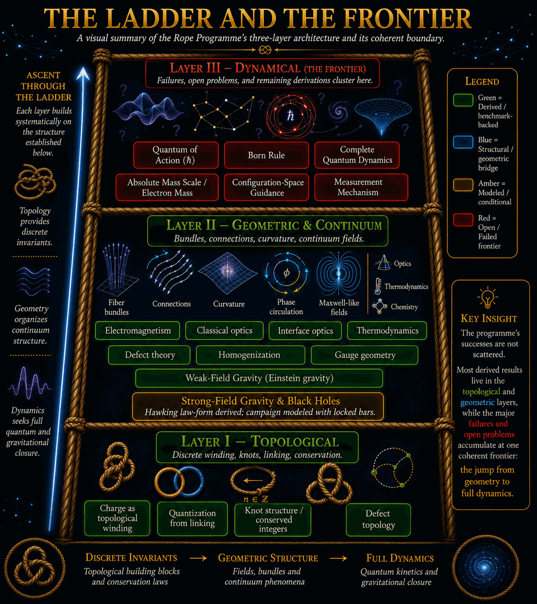
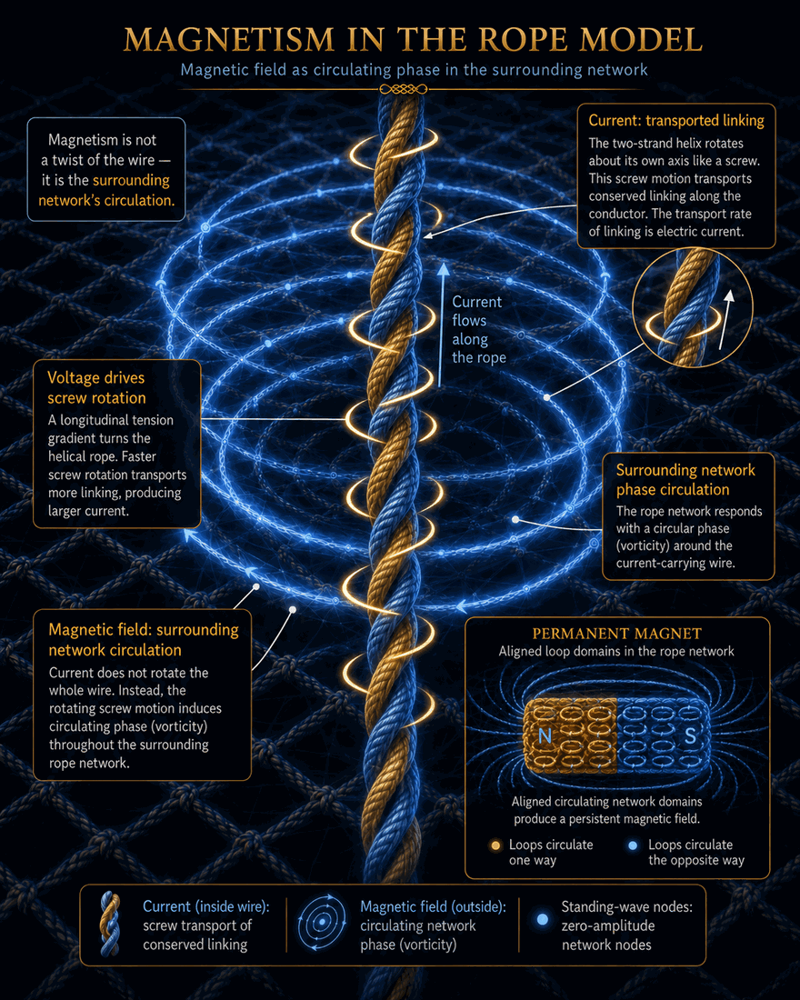
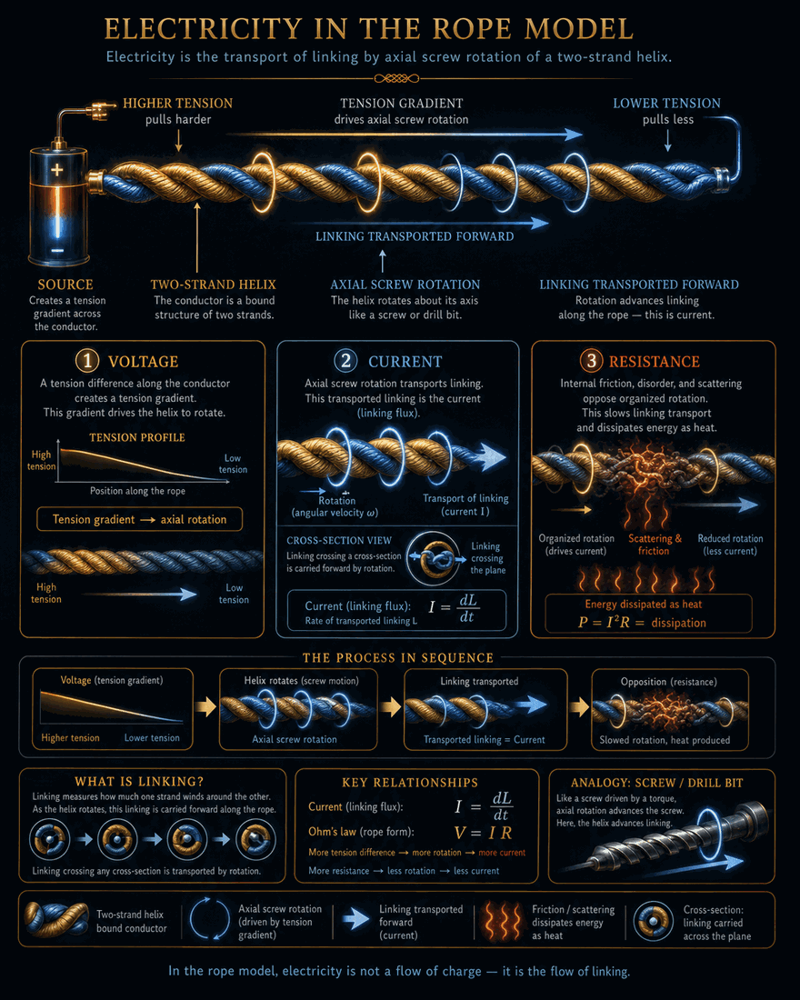
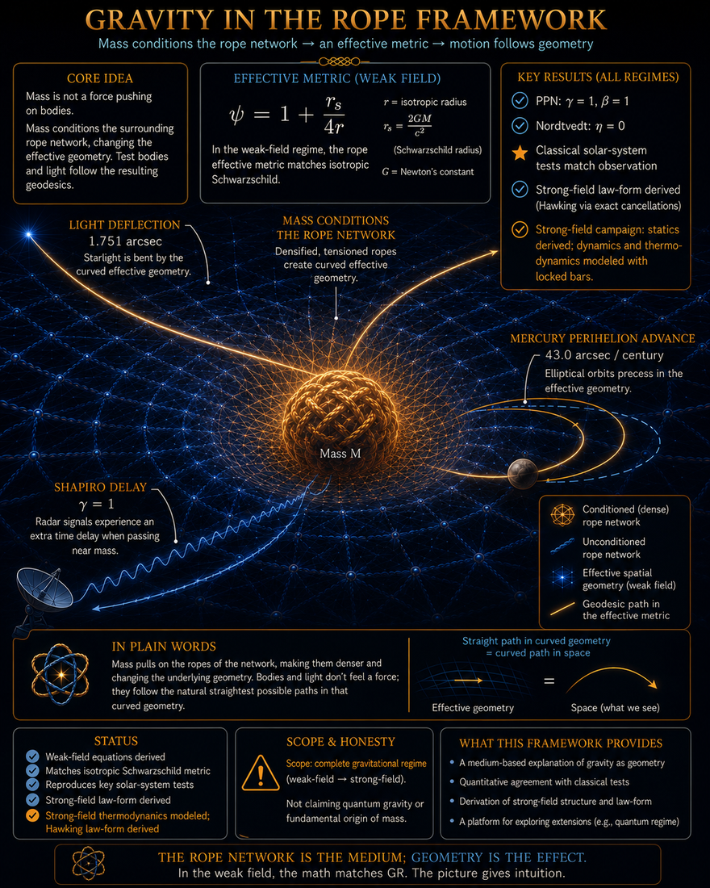
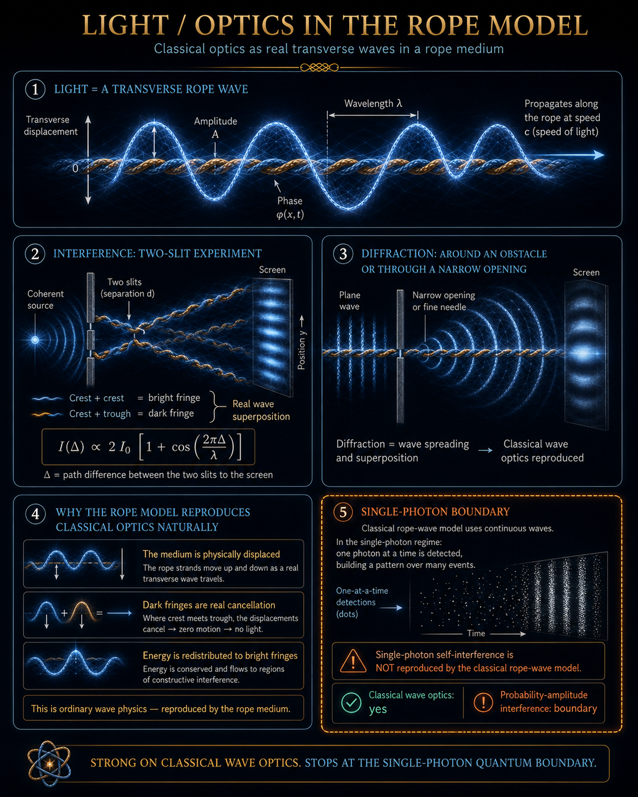
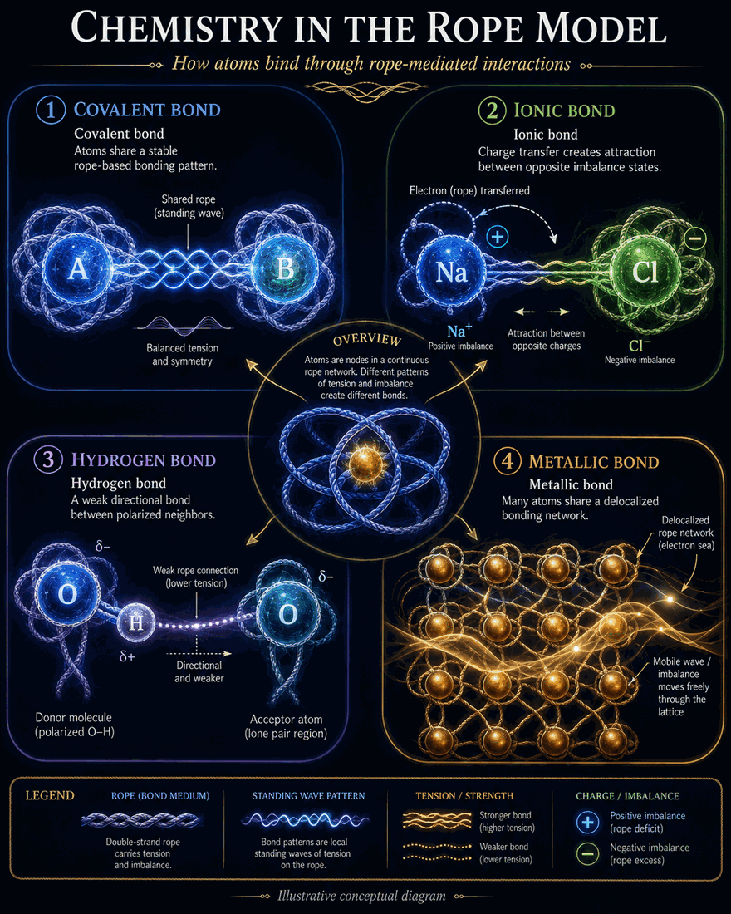
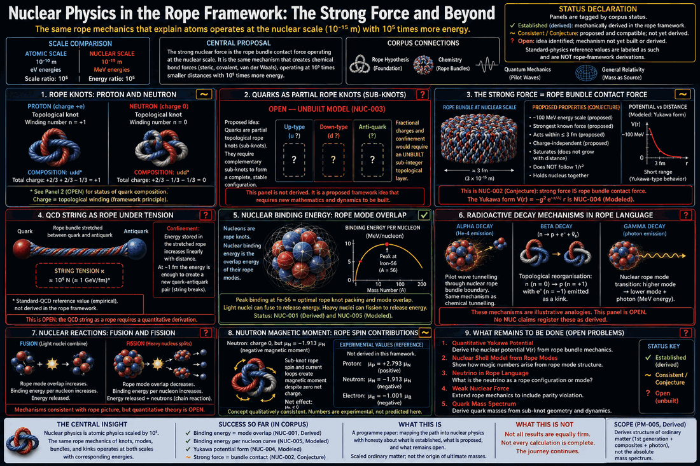
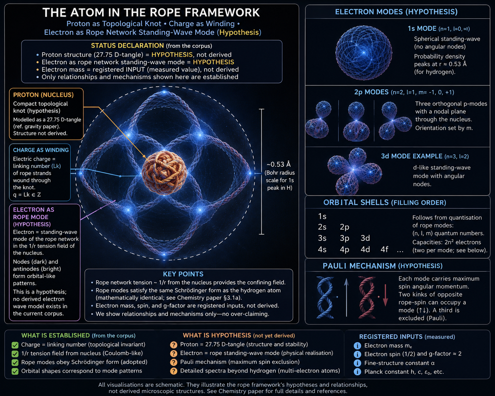

# Eleven Results We Did Not Expect

*A non-technical companion to the corpus — and how the investigation actually unfolded. This is a speculative research programme — the odds
are long and we say so — but along the way the work kept surprising us, and people remember
stories. Four of the eleven are failures. That is on purpose: a programme that only reports its
wins is advertising, not science. Every surprise below links to registered, machine-verified
claims you can rerun yourself (see the [Roadmap](ROADMAP.md)).*

---

*Before the stories, the map. The whole programme in one figure: derived results (green) cluster in the Topological and Geometric layers; the failures and open problems — Bell, the Born rule, ħ, the measurement problem, absolute mass, quantum-gravity closure — pile against a single coherent line, the jump from geometry to full dynamics. The successes are not scattered, and the failures share a boundary. That structure, not any single result, is the corpus's most distinctive claim. [Figure notes.](../figures/README.md)*

---

## 1. Maxwell came out for free

*Category: derived emergence.*

We started with something almost childishly simple: a medium of rope-like filaments that can
stretch, twist, and wave. We did not put electromagnetism in. When the collective equations of
the medium were worked out, the structure of Maxwell's electromagnetism emerged from the rope
kinematics — fields as states of the medium, light as torque waves running along it. A theory's
first surprise is finding something in the box you didn't pack. *(Electromagnetism sector — 34
claims, 15 Derived.)*

*Magnetism as phase circulation; current as screw-transported linking (matching the electricity figure). Backed by EM-008/014 (Derived, current) and EM-012/013 (Derived, forces); the two EM figures are the two levels reconciled in EM-RECON-001. [Figure notes.](../figures/README.md)*

## 2. Electric charge behaves like a knot you can't untie

*Category: derived structure.*

In the framework, charge is not a substance painted on particles — it is a topological winding,
a twist configuration that cannot be smoothly undone. That one idea explains, without extra
rules, why charge comes in whole units and why it is conserved no matter what: you cannot
half-untie a knot, and no smooth motion removes a winding. The surprise was how much bookkeeping
physics gets for free once conservation is geometry instead of decree.

*Electricity as transport of linking by axial screw-rotation, I = dL/dt. Backed by EM-008 (Derived) and EM-009 (Modeled). [Figure notes.](../figures/README.md)*

## 3. Gravity said no — until the medium earned its yes, all the way to Hawking's law

*Category: kept failure, then a derived recovery — the corpus's longest arc.*

If the rope idea were a fantasy, gravity would have "worked" on the first try — fantasies
always work. Instead our largest sector (88 claims) opens with a long campaign in which every
CLASSICAL route to Einstein gravity failed, and those failures are still registered in red
next to the successes: a no-go theorem (gamma in [−1, 0] against the measured 1) that we kept
at full strength because it did its job — it pointed at the one door left open. The sector
then walked through it. The quantum-induced channel DERIVED the weak field unconditionally
(GRV-025/026/029): gamma = 1, light deflection 1.751″ against the photographed 1.75″, and the
full classical-test table. And in the strong-field campaign of August 2026 (GRV-074..088) the
same machinery, pushed to the horizon with bars locked before every computation, produced the
result we would frame: the temperature a distant observer sees is proportional to the black
hole's surface gravity — **Hawking's law-form, with Hawking nowhere in the inputs** — falling
out of three exact cancellations in which the horizon geometry divides out of its own ratios.
Accretion emerged from the energy bookkeeping without being put in; collapse became permanently
recorded structure; and the campaign ended the way this project prefers: two of our OWN routes
to the law's coefficient disagree by four orders of magnitude, the tension is registered at
full strength with the suspects pre-listed, and the adjudication is a computation we owe
ourselves. Gravity said no, the corpus kept the no, earned the yes, and then derived the most
famous result in black-hole physics in form — and then closed its own case: four further
sessions (GRV-089..091) found the four-order dispute was a CATEGORY ERROR, a temperature
coefficient set against a ringing-frequency coefficient. Both predictions stand at their own
questions: the pitch is geometric (0.23 kappa), the rate is thermodynamic, and the black hole
is a crackling-noise emitter — cold reservoir, bright snaps. The theory subpoenaed itself, the
indictment was ruled defective, and the surviving question is the quantum of the ring: the
hbar frontier, arrived at the horizon's doorstep. *(Gravity & Galaxies sector — Failed claims kept; see papers/rope_blackholes.pdf.)*

*The figure's original caption told act one — the failures kept in red. The record now runs
two acts further: the weak field derived unconditionally (gamma = 1, 1.751″), and the strong
field carried to the Hawking law-form T_inf ∝ kappa (GRV-087), with the coefficient dispute
since RESOLVED as a category error, both routes standing (GRV-091). [Figure notes.](../figures/README.md)*

## 4. The model told us where its own world ends

*Category: kept failure — a located boundary.*

Bell's theorem says no local, classical mechanism can reproduce all quantum correlations. Our
medium is local and classical — and when we tested it honestly, it hit exactly that wall. The
surprise was not the failure; it was that the framework was clean enough to *locate its own
boundary* rather than fudge past it. The quantum boundary sector now maps precisely which
quantum phenomena the ropes can and cannot reach. *(Quantum Boundary sector — 27 claims,
including the Bell failure, kept.)*

*Optics with its limit drawn in: classical wave optics fully reproduced (OPT-001..010, Derived), and single-photon self-interference marked in orange as NOT reproduced — the same boundary, drawn where light meets it. [Figure notes.](../figures/README.md)*

## 5. Galaxy rotation curves worked without dark matter

*Category: modeled result — interesting, interpretation open.*

Applied to the SPARC catalogue of real galaxy rotation curves, the rope medium's long-range
behavior fit the data competitively with MOND-class models — no dark matter halo dialed in per
galaxy. We do not know if this is deep or coincidental, and the registry says so. But a
tabletop-motivated medium having anything sensible to say about galaxies surprised everyone
involved. *(Gravity & Galaxies sector.)*

## 6. We calibrated on an atom and predicted a molecule

*Category: zero-parameter prediction (16% level).*

The model's one electromagnetic coupling was calibrated on a single number: the hydrogen atom's
13.6 eV. With no further freedom, it then predicted the vibration frequency of the H2
*molecule* — a different physical system — to within 16%. Sixteen percent is not precision
physics; it is, however, the right order, the right structure, and zero free parameters, which
is exactly what a sketch of real physics looks like before it grows up. *(EM-RECON-010.)*

*Covalent, ionic, hydrogen, and metallic bonds as tension/standing-wave patterns. **Status: modeled, not derived** (the sector is 13 Modeled / 2 Derived). [Figure notes.](../figures/README.md)*

## 7. The dead zero

*Category: measured calibration result.*

Our knot-tightening code is about a hundred lines. After measuring (not fitting) one systematic
constant of the solver, its computed size for the figure-eight knot came out 21.039 against the
research literature's 21.040 — agreement in the fourth digit with decades of specialized
computation. Five independent subsystems had to be simultaneously correct for that zero to
appear; stacked errors do not cancel to four figures. It was the moment we started trusting the
instrument more than our intuitions. *(FND-MATTER-027.)*

## 8. The library handed us a coincidence we never ordered

*Category: labeled coincidence.*

Our stand-ins for the neutron and proton are two composite knots — the "granny" and the
"square" — that differ only in the handedness of their halves. When we finally checked the
authoritative literature, their ideal sizes turned out to be nearly identical: split by 0.05%.
The real neutron and proton differ by 0.14%. A near-degenerate twin pair, sitting in decade-old
reference data, exactly where a knot-doublet story would need one. We banked it as a labeled
coincidence — and the very next day, the framework tried to kill it (see #9). *(FND-MATTER-028.)*

## 9. The theory executed its own favorite hypothesis

*Category: internal elimination — derived audit.*

Deriving the model's last unknown from its own microstructure produced a consistency test —
and the beloved doublet hypothesis failed it spectacularly: making the twins be the neutron and
proton (in the quantum reading) would require the medium's mesh to be two thousand times coarser
than the framework's own relativity constraints allow. The kill was internal, arithmetic, and
registered within a day of banking the coincidence. Most speculative theories bend their rules at this moment; ours eliminated the hypothesis, and
only a more modest classical version of the idea survived. That day is our best evidence that the *methodology* works, whatever the physics.
*(FND-MATTER-033.)*

## 10. The unknowable dial became a percolation threshold — and landed on the edge

*Category: zero-parameter computation; the consistency remains a labeled conditional.*

For months, every mass-sector claim ended with the same confession: the scale lambda is
unknown. Over one long arc it was cornered step by step — collapsed to a formula, its quantum
form killed (#9), its surviving form reduced to pure geometry — until the last question became:
*how crowded must ropes be before another rope can no longer slip through?* That is a
percolation problem. We simulated it, with zero adjustable numbers, and out came
lambda ≈ 0.013–0.017 — landing at the edge of the independently inferred window — the range the neutron–proton
comparison had pointed to before the simulation existed. The simulation knew nothing about particles. Too close to dismiss,
too edgy to celebrate: the most honest kind of result. *(FND-MATTER-036..038.)*

## 11. The computer became the skeptic

*Category: infrastructure — and, in hindsight, the load-bearing surprise.*

Somewhere along the way, we stopped trusting ourselves — and built software that doesn't have
to. Every claim acquired an identifier, a status, and a dependency list. Every result became an
executable benchmark; every failure *stayed* executable. And the verifier turned out to be a
stricter reviewer than we were: it has caught duplicate registrations, missing files, benchmark
mismatches, and configuration-fragile tests before they ever reached publication — including,
in one weekend, three of our own over-eager assertions. The most surprising discovery of the
whole programme may be this: the discipline was not a tax on the science. It *was* the science.
The physics might be wrong; the method of finding out is not. *(tools/verify_corpus.py — 223
benchmarks, rerun on every change.)*

---

*Nuclear physics as atomic mechanics scaled by 10^5 — and the clearest example of the project's status discipline applied to a figure: Established (binding-energy/Fe-56, NUC-001/005), Conjecture (strong force = bundle contact, NUC-002), and Open/unbuilt (quarks, the QCD string, decay mechanisms) are each drawn with honest tags rather than uniform confidence. An earlier draft over-claimed; it was corrected against the registry before inclusion. [Figure notes.](../figures/README.md)*

**Honorable mentions, for connoisseurs:** our knot-identification instrument reproduced a
theorem it was never taught (the Alexander polynomial's multiplicativity, appearing unprompted
as the integer 27 = 3³); a miss kept honestly in the record acquired its full explanation
twenty claims later (2.3% instrument systematic + 4.1% genuine effect) — the keep-your-failures
policy paying compound interest; and we measured that tight knots touch themselves essentially
*everywhere* — a fact about our own objects we only discovered when an instrument twice
reported impossible numbers and was twice repaired.

---

*The atom figure is this document in one image: every element tagged Established (green), Hypothesis (orange), or Registered Input (blue). Charge-as-linking and 2n² shell capacities are Derived (FND-008, CHEM-STRUCT-001); the proton-tangle, the electron-mode, and the Pauli mechanism are labeled hypotheses; the electron's mass, spin, and g-factor are measured inputs (PM-005). [Figure notes.](../figures/README.md)*

*None of this proves the rope hypothesis. All of it is rerunnable. That combination is the
point.*
